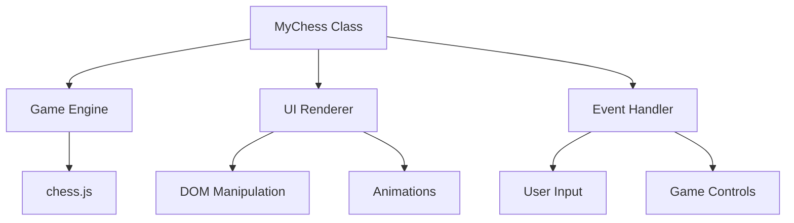

# MyChess - Modern Chess Implementation

## Developer Documentation

### Table of Contents
1. [Project Overview](#project-overview)
2. [Features](#features)
3. [Dependencies](#dependencies)
4. [Architecture](#architecture)
5. [Core Components](#core-components)
6. [API Reference](#api-reference)
7. [Development Setup](#development-setup)
8. [Contributing](#contributing)
9. [Credits](#credits)
10. [License](#license)
11. [Glossary](#glossary)

---

## Project Overview <a name="project-overview"></a>
A modern chess implementation featuring:
- Complete chess rules enforcement
- Responsive SVG-based UI
- Animated piece movements
- Multi-platform support (desktop/mobile)
- Game state management
- Move validation and history

---

## Features <a name="features"></a>
- **Game Engine**
  - Full chess.js integration
  - Move validation
  - Check/checkmate detection
  - En passant & castling support
  - Promotion handling
- **UI System**
  - SVG piece rendering
  - Legal move highlighting
  - Board flipping
  - Move animations
- **Additional Features**
  - Game timers
  - Move history
  - Sound effects
  - Hint system
  - Promotion dialog

---

## Dependencies <a name="dependencies"></a>
- **chess.js** (BSD 2-Clause License)
  - Chess rules implementation
  - Move generation/validation
- **Wikimedia Commons SVGs**
  - Chess piece graphics
- **Mixkit Sound Effects**
  - Game audio feedback

---

## Architecture <a name="architecture"></a>


---

## Core Components <a name="core-components"></a>

### 1. MyChess Class
```javascript
class MyChess {
  constructor() {
    this.game = new Chess(); // chess.js instance
    this.pieceImages = { w: {}, b: {} }; // SVG cache
    this.timers = { w: 0, b: 0 }; // Game clocks
    // ... other properties
  }
  
  async loadPieces() { /* SVG preloading */ }
  renderBoard() { /* DOM rendering */ }
  executeMove() { /* Move validation */ }
  // ... other methods
}
```

### 2. Game Loop
1. User interaction → Event Handler
2. Move validation → chess.js
3. State update → MyChess
4. UI rendering → DOM updates
5. Audio/visual feedback

---

## API Reference <a name="api-reference"></a>

### Public Methods
| Method | Parameters | Description |
|--------|------------|-------------|
| `executeMove()` | `move: {from, to, promotion}` | Validate and execute move |
| `undoMove()` | - | Revert last two moves |
| `flipBoard()` | - | Rotate board perspective |
| `showHint()` | - | Display suggested move |
| `resetGame()` | - | Initialize new game |

---

## Development Setup <a name="development-setup"></a>
1. **Requirements**
   - Modern browser (Chrome/Firefox/Safari)
   - Local web server (CORS requirements)

2. **Installation**
   ```bash
   git clone https://github.com/I-Himanshu/Chess.git
   cd Chess
   python3 -m http.server 8000
   ```
   Access via `http://localhost:8000`

3. **Build Process**
   - No build required (pure ES6)
   - Optional: Minify with Webpack/Rollup

---

## Contributing <a name="contributing"></a>
1. Fork repository
2. Create feature branch
3. Follow existing code style
4. Write unit tests (using Jest)
5. Submit PR with documentation

---

## Credits <a name="credits"></a>
- **Chess Logic**: [chess.js](https://github.com/jhlywa/chess.js)
- **ChessComFiles**: [ChessComFiles](https://images.chesscomfiles.com)
- **Sound Effects**: [Mixkit](https://mixkit.co)
- **Initial Concept**: [Original Developer](#)

---

## License <a name="license"></a>
MIT License
```
Copyright 2025 Himanshu Kumar

Permission is hereby granted... (standard MIT text)
```

---

## Glossary <a name="glossary"></a>
- **FEN**: Forsyth-Edwards Notation (game state representation)
- **PGN**: Portable Game Notation (move recording format)
- **En passant**: Special pawn capture move
- **Castling**: King-rook defensive maneuver
- **Promotion**: Pawn-to-queen conversion
- **Checkmate**: Winning condition
- **Stalemate**: Draw condition

---

[⬆ Back to Top](#MyChess---modern-chess-implementation)
